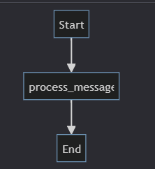
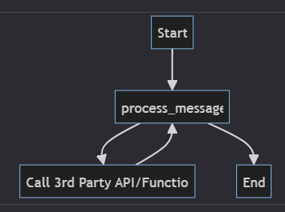

# 🧠 Chatbot Platform - Backend (Test Task)

This is a backend system built for a chatbot platform as part of a test task. It supports real-time communication using WebSockets, integrates with LLMs, and leverages asynchronous FastAPI with LangGraph for agent workflows.

🗨️ The chatbot **remembers conversation context**, allowing users to **continue previous chats** seamlessly. Whether you're starting a new conversation or picking up where you left off, the system keeps track of the dialogue intelligently.

---

## 🚀 Tech Stack

- **Python**
- **FastAPI**
- **LangGraph**
- **WebSocket**
- **Asynchronous Programming**
- **LLM Integration**
- **PostgreSQL**

---

## 🛠️ Installation Guide

Follow these steps to get the backend running locally:

1. **Clone the repository**

   ```bash
   git clone <repo_url>
   cd <repo_folder>


2. **Create a virtual environment**

   ```bash
   python3 -m venv venv
   source venv/bin/activate  # On Windows: venv\Scripts\activate
   ```

3. **Install dependencies**

   ```bash
   pip install -r requirements.txt
   ```

4. **Create a `.env` file**

   Add the following variables to your `.env` file:

   ```env
   GROQ_API_KEY=your_groq_api_key
   DATABASE_URL=postgresql://<user>:<password>@<host>:<port>/<db_name>
   ```

5. **Get your Groq API key**

   Visit [https://console.groq.com/keys](https://console.groq.com/keys) and generate a new key. Add it to your `.env` file as shown above.

6. **Run the server**

   ```bash
   python app/main.py
   ```

   The server should start on `http://0.0.0.0:8000`

7. **Using Docker (optional)**
   ```bash
   docker compose pull
   docker compose up -d 
   ```
   You might need to change database host so that docker container can access local database.

---

## 📡 WebSocket API Docs

### 🔌 WebSocket Endpoint

**Connect to chat (real-time)**

```
ws://localhost:8000/ws/{user_id}
```

Use this endpoint to connect a user to the WebSocket for real-time chat interactions.

---

### 📥 Connection Status Endpoint

**Check WebSocket status for a user**

```
GET /ws/users/{user_id}/status
```

**Sample Request Body (for sending a message):**

```json
{
  "message": "Hello!",
  "conversation_id": 123  // optional; omit for new chat session
}
```

---

## 🧪 Testing

To test the WebSocket setup and API functionality, simply run:

```bash
python app/test_websocket.py
```

This script will connect to the chat WebSocket and simulate sending and receiving a message.

---
For unit testing using pytest, simply run:
```bash
python app/test_main.py
```
---

## 🔗 Groq API Usage

This project uses the **Groq API** for integrating LLM-based conversational intelligence.

* The model used is: **`llama3-8b-8192`**
* This choice was made because the chatbot is designed for **simple, real-time conversations**, and does not require a massive model like 70B or higher.
* Using Groq provides **free API usage** with low-latency responses — ideal for testing, prototyping, or light production workloads.

To use Groq:

1. Go to [https://console.groq.com/keys](https://console.groq.com/keys) and create an API key.
2. Add it to your `.env` as:

   ```env
   GROQ_API_KEY=your_api_key_here
   ```

This setup keeps inference fast, cost-efficient, and good enough for maintaining context in multi-turn interactions.

---

## 🧠 Why LangGraph?

LangGraph enables structured and memory-aware agent workflows, making it ideal for:

* Managing **multi-step reasoning** in chatbot flows
* Retaining context across multiple interactions
* Simplifying integration of **custom tools and agents**
* Supporting **graph-style logic**, allowing modular and scalable chatbot design

It brings clarity to complex agent flows and makes your chatbot much more than a one-shot LLM responder.

## Architecture Diagram



---

## 📌 Notes

* Ensure PostgreSQL is running and your `DATABASE_URL` is correctly set.
* The project uses async features, so avoid blocking code in handlers.
* This backend is designed to be integrated with a chatbot frontend or another service layer that handles user interfaces.

---

## 🔮 Future Enhancements

* ⚙️ **Easily add multiple agents** and build modular, context-aware chatbot flows with LangGraph

* 🔐 **Add user authentication** to manage user access and session security
* ☁️ Deploy using Docker, Kubernetes, or serverless stacks
* 🧠 Add persistent long-term memory and custom knowledge bases

---

> Built for test purposes, but scalable for real-world LLM chatbot applications. 🚀

